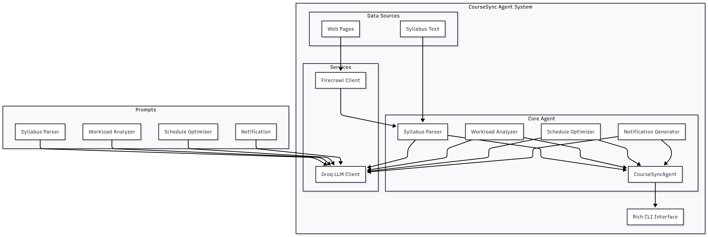

# CourseSync-Agent

An intelligent academic course management CLI Agent powered by Groq LLM for syllabus parsing, workload analysis, and smart scheduling.

## Problem Statement

The academic course management landscape faces several critical challenges:

1. **Manual Syllabus Processing**: Time-consuming manual extraction of assignment information from syllabus
2. **Workload Management**: Difficulty in balancing assignments and study time across multiple courses
3. **Deadline Tracking**: Challenge in managing multiple deadlines and prioritizing tasks effectively
4. **Study Planning**: Lack of optimized study schedules that account for workload distribution
5. **Proactive Notifications**: Missing timely reminders and strategic study recommendations

CourseSync-Agent addresses these challenges through an intelligent multi-agent system that automates course data synchronization, validation, and management.

## System Architecture


## System Design & Reasoning Flow

### Core Components

1. **CourseSyncAgent**
   - Syllabus Parser: Extracts structured data from course syllabi
   - Workload Analyzer: Identifies workload distribution and risk periods
   - Schedule Optimizer: Creates personalized study schedules
   - Notification Generator: Provides strategic alerts and reminders

2. **Technology Stack**
   - **Language Models**:
     - Groq LLM (llama-3.3-70b-versatile) for intelligent processing
   
   - **External Services**:
     - Firecrawl API for web page scraping
   
   - **UI Framework**:
     - Rich CLI for beautiful terminal interface
     - Progress indicators and styled output
     - Interactive menu system

3. **Data Structures**
   - Course information (name, code, instructor)
   - Assignments (name, type, due date, weight, hours)
   - Workload analysis (weekly breakdown, risk periods)
   - Study schedule (daily tasks, priorities)
   - Smart notifications (deadlines, reminders, warnings)

### Data Flow

1. Input Sources:
   - Manual syllabus text entry
   - Web page scraping via Firecrawl
   - Configuration via environment variables
   - User preferences (study hours, semester dates)

2. Processing Pipeline:
   - Syllabus parsing with structured JSON output
   - Workload analysis with risk identification
   - Schedule optimization with task breakdown
   - Smart notification generation

3. Output Generation:
   - Interactive CLI displays
   - Structured JSON data exports
   - Progress indicators and status updates
   - Color-coded notifications and warnings

## Limitations and Future Work

### Current Limitations

1. **Input Constraints**
   - Manual syllabus text entry required
   - Limited web scraping capabilities
   - No direct calendar integration
   - Fixed study hour estimations

2. **Technical Constraints**
   - Groq API dependency
   - No offline mode support
   - Limited data persistence
   - Basic error handling

3. **Feature Limitations**
   - No collaborative features
   - Static notification rules
   - Limited customization options
   - No progress tracking

### Future Work

1. **Enhanced Capabilities**
   - PDF syllabus parsing
   - Calendar integration (Google, iCal)
   - Dynamic study hour estimation
   - Progress tracking and analytics

2. **Technical Improvements**
   - Multi-LLM provider support
   - Local data persistence
   - Offline mode operation
   - Enhanced error handling

3. **Feature Expansions**
   - Collaborative study groups
   - Custom notification rules
   - Mobile companion app
   - Learning style adaptation

## Getting Started

1. **Prerequisites**
   - Python 3.7+
   - pip package manager
   - Groq API key
   - (Optional) Firecrawl API key for web scraping

2. **Installation**
   ```bash
   # Clone the repository
   git clone https://github.com/AsmSafone/CourseSync-Agent.git
   cd CourseSync-Agent

   # Create and activate virtual environment
   python -m venv coursesync-env
   .\coursesync-env\Scripts\activate  # Windows
   source coursesync-env/bin/activate # Linux/Mac

   # Install dependencies
   pip install -r requirements.txt
   ```

3. **Configuration**
   Create a `.env` file in the project root:
   ```env
   GROQ_API_KEY=your_groq_api_key_here
   FIRECRAWL_API_KEY=your_firecrawl_api_key_here  # Optional
   ```

4. **Running the Application**
   ```bash
   python main.py
   ```

## Usage

1. **Adding Courses**
   - Input syllabus text directly
   - Or provide course webpage URL for scraping

2. **Analyzing Workload**
   - View weekly hour distribution
   - Identify high-risk periods
   - Get personalized recommendations

3. **Managing Schedule**
   - Generate optimized study plans
   - Customize daily study hours
   - Track assignment progress

4. **Smart Notifications**
   - Receive strategic reminders
   - Get early warnings for heavy workloads
   - Celebrate assignment completions

## Contributing

1. Fork the repository
2. Create your feature branch (`git checkout -b feature/AmazingFeature`)
3. Commit your changes (`git commit -m 'Add some AmazingFeature'`)
4. Push to the branch (`git push origin feature/AmazingFeature`)
5. Open a Pull Request

## License

Distributed under the MIT License. See `LICENSE` for more information.
